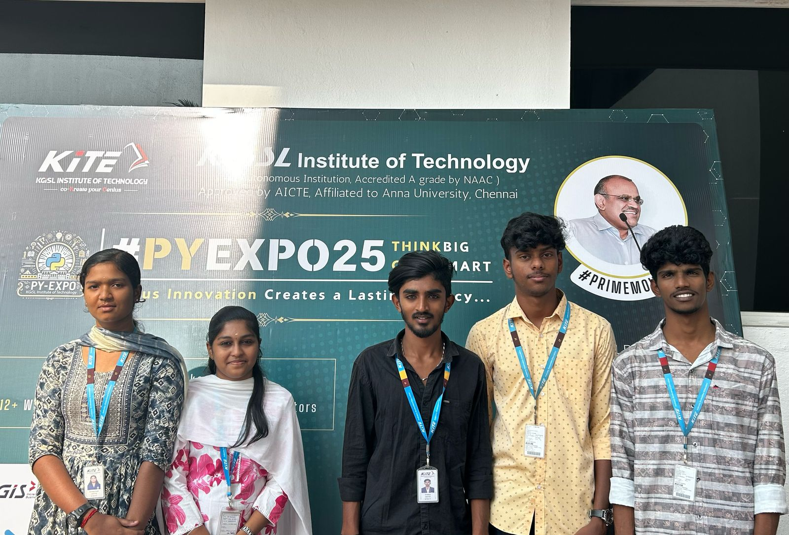

---

## Problem Statement

*Problem Statement ID – PY028*

Fingerprint Door lock system with LCD Display

---

## Overview

A **Fingerprint Door Lock System** is a biometric security solution that uses fingerprint recognition technology to allow access to a door or building. Here's a simple overview:

1. **Fingerprint Scanning**: The system captures a person's fingerprint, typically using a scanner built into the door lock. This is the primary form of authentication.

2. **Enrollment Process**: When setting up the system, users must register their fingerprints into the system database. Multiple fingerprints can be stored for different users (e.g., family members, employees).

3. **Access Control**: When a registered user places their finger on the scanner, the system compares the scanned fingerprint with the stored data. If the match is found, the door is unlocked.

4. **Enhanced Security**: Since fingerprints are unique to individuals, it provides a high level of security compared to traditional key-based locks. The system typically also logs access attempts.

5. **Convenience**: There's no need to carry keys or remember codes, and access can be easily managed by adding or removing fingerprints.

6. **Additional Features**: Some advanced systems may include features like password backup, mobile app control, or integration with smart home systems.
---

## Team Members

*Team ID – T040*

List your team members along with their roles.

- * Ganga gowri M * - Team leader
- * Ivin M * - Software
- * Keerthi Priyadharshini * - Software
- * Prarthanan P * - Hardware
- * Adithya R * - Hardware

---

## Technical Stack

List the technologies and tools used in the project. For example:

- *Other Tools:* python, c++, c 

---

## Getting Started

Follow these steps to clone and run the application locally.

### Prerequisites

1. Install [Python](https://www.python.org/downloads/).
2. Clone this repository:
   bash
   git clone : https://github.com/PYEXPO25/T040_FUTURE_FORGE.git
   

### Installation

1. Navigate to the project directory:
   bash
   cd repository-T040_FUTURE_FORGE
   
2. Create a virtual environment:
   bash
   python -m venv venv
   
3. Activate the virtual environment:
   - On Windows:
     bash
     venv\Scripts\activate
     
   - On macOS/Linux:
     bash
     source venv/bin/activate
     
4. Install dependencies:
   bash
   pip install -r requirements.txt
   
5. Navigate to source
   bash
   cd source
   

---

## Start the Application

1. Run the Flask application:
   bash
   flask run
   
2. Open your browser and navigate to:
   
   http://127.0.0.1:5000/
   

---
## Resources

### 📄 PowerPoint Presentation
[Click here to view the PPT]( https://github.com/PYEXPO25/T040_FUTURE_FORGE/blob/main/Resource/REVISED%20PPT%20(2).pdf )

### 🎥 Project Video
[Click here to view the project demo video](https://github.com/PYEXPO25/T040_FUTURE_FORGE/blob/main/Resource/Demo%20video.mp4)

---
